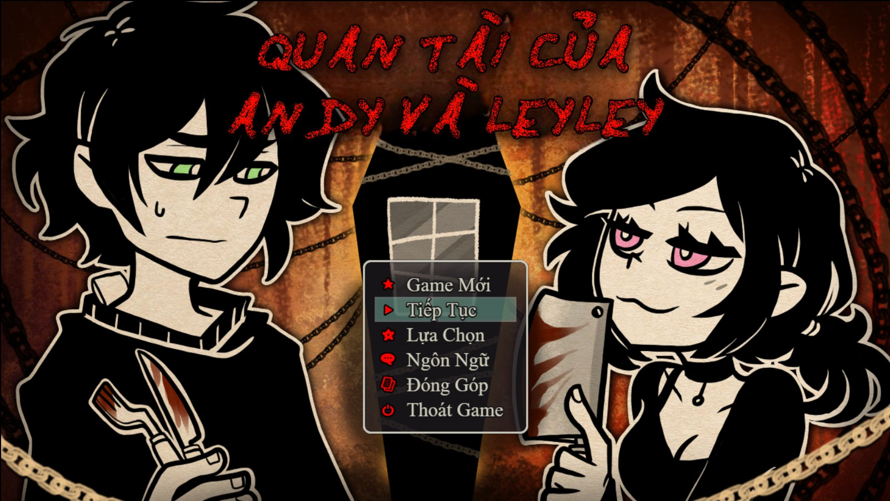
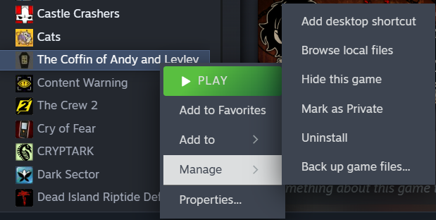

# CLEAN CGS WITHOUT TEXT
<b>THIS REPOSITORY ALSO HAS CGs WITH TEXT MANUALLY REMOVED</b> (except for the main menu CG, I used AI for that,) <b>IF YOU'RE LOOKING FOR THEM THEY'RE IN THE "SourceAssets" FOLDER.</b>

# The Coffin of Andy and Leyley Vietnamese translation
The Coffin of Andy and Leyley Vietnamese translation with CGs translated. <b>Based on [Orthez's](https://steamcommunity.com/profiles/76561199376023377) translation.</b>

Made on ver. 2.0.14

    

## Installation
* Go to releases
* Download "VITranslation.zip"
* Head into your TCoAaL folder

<i>Click me if you don't know how to find the folder</i>

* 

* Open "www" then "languages"
* Extract the vi folder in there
* Finally, head into the game and you should be able to pick Vietnamese in the language option

## Cài đặt
- Đi đến phần phát hành (releases)  
- Tải xuống tệp "VITranslation.zip"  
- Mở thư mục TCoAaL của bạn  

  

<i>Bấm vào đây nếu bạn không biết cách tìm thư mục</i>
  
-   

  

- Mở "www", rồi tiếp là "languages"  
- Giải nén thư mục "vi" vào đó  
- Mở game và bạn sẽ có thể chọn tiếng Việt trong phần cài đặt ngôn ngữ (languages)

# Clean CGs FAQs
## How do I open PDN files?
You need to install Paint.net, you can find it [here](https://www.getpaint.net/download.html).

## What is the difference between PDN and PNG?
PDN files has layers which can be moved, so that you can put text under another object. Ground20 is a good example of this.

PNG are fixed, they don't have layers.

