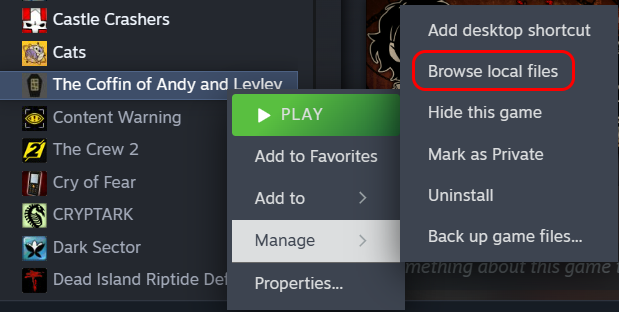

# CLEAN CGS WITHOUT TEXT
<b>THIS REPOSITORY ALSO HAS CGs WITH TEXT MANUALLY REMOVED</b> (except for the main menu CG, I used AI for that,) <b>IF YOU'RE LOOKING FOR THEM THEY'RE IN THE "SourceAssets" FOLDER.</b>
# TCoAaL-vi
The Coffin of Andy and Leyley Vietnamese translation with CGs translated. Based on Orthez and San's translation.

    

## Installation
* Go to releases
* Download "vi.zip"
* Head into your TCoAaL folder

* 

* Open "www" then "languages"
* Extract the vi folder in there
* Finally, head into the game and you should be able to pick Vietnamese in the language option

# Clean CGs FAQs
<b>"I can't open the files"</b>

You need to install Paint.net, you can find it [here](https://www.getpaint.net/download.html).

I'll add more FaQs soon